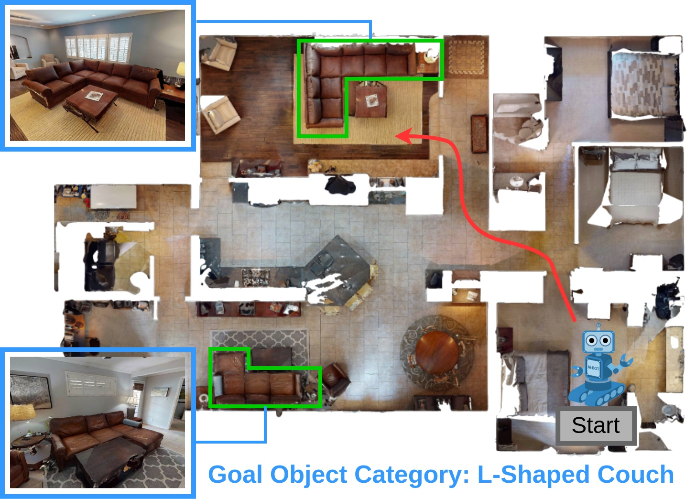

<p align="center">
  
  <h1 align="center">HM3D-OVON: A Dataset and Benchmark for Open-Vocabulary Object Goal Navigation</h1>
  <h3 align="center">
    <a href="http://naoki.io/">Naoki Yokoyama</a>,
    <a href="https://ram81.github.io/">Ram Ramrakhya</a>,
    <a href="https://abhishekdas.com/">Abhishek Das</a>,
    <a href="https://faculty.cc.gatech.edu/~dbatra/">Dhruv Batra</a>,
    <a href="https://faculty.cc.gatech.edu/~sha9/">Sehoon Ha</a>
  </h3>
  <p align="center">
    <a href="http://naoki.io/portfolio/ovon.html">Project Website</a>
  </p>
</p>

## Overview

We present the Habitat-Matterport 3D Open Vocabulary Object Goal Navigation dataset (HM3D-OVON), a large-scale benchmark that broadens the scope and se- mantic range of prior Object Goal Navigation (ObjectNav) benchmarks. Leveraging the HM3DSem dataset, HM3D-OVON incorporates over 15k annotated instances of household objects across 379 distinct categories, derived from photo-realistic 3D scans of real-world environments. In contrast to earlier ObjectNav datasets, which limit goal objects to a predefined set of 6-21 categories, HM3D-OVON facilitates the training and evaluation of models with an open-set of goals defined through free-form language at test-time. Through this open-vocabulary formulation, HM3D-OVON encourages progress towards learning visuo-semantic navigation behaviors that are capable of searching for any object specified by text in an open- vocabulary manner. Additionally, we systematically evaluate and compare several different types of approaches on HM3D-OVON. We find that HM3D-OVON can be used to train an open-vocabulary ObjectNav agent that achieves both higher performance and is more robust to localization and actuation noise than the state-of-the-art ObjectNav approach. We hope that our benchmark and baseline results will drive interest in developing embodied agents that can navigate real-world spaces to find household objects specified through free-form language, taking a step towards more flexible and human-like semantic visual navigation. Videos available at: naoki.io/ovon.

## :hammer_and_wrench: Installation

### Getting Started

Create the conda environment and install all of the dependencies. Mamba is recommended for faster installation:
```bash
conda_env_name=ovon
mamba create -n $conda_env_name python=3.7 cmake=3.14.0 -y
mamba install -n $conda_env_name \
  habitat-sim=0.2.3 headless pytorch=1.12.1  cudatoolkit=11.3 \
  -c pytorch -c nvidia -c conda-forge -c aihabitat -y

# Install this repo as a package
mamba activate $conda_env_name
pip install -e .

# Install distributed_dagger and frontier_exploration
cd frontier_exploration && pip install -e . && cd ..

# Install habitat-lab
git clone --branch v0.2.3 git@github.com:facebookresearch/habitat-lab.git
cd habitat-lab
pip install -e habitat-lab
pip install -e habitat-baselines

pip install ftfy regex tqdm GPUtil trimesh seaborn timm scikit-learn einops transformers
```
## :dart: Downloading the datasets
First, set the following variables during installation (don't need to put in .bashrc):
```bash
MATTERPORT_TOKEN_ID=<FILL IN FROM YOUR ACCOUNT INFO IN MATTERPORT>
MATTERPORT_TOKEN_SECRET=<FILL IN FROM YOUR ACCOUNT INFO IN MATTERPORT>
DATA_DIR=</path/to/ovon/data>
```

### Clone and install habitat-lab, then download datasets
```bash
# Download HM3D 3D scans (scenes_dataset)
python -m habitat_sim.utils.datasets_download \
  --username $MATTERPORT_TOKEN_ID --password $MATTERPORT_TOKEN_SECRET \
  --uids hm3d_train_v0.2 \
  --data-path $DATA_DIR &&
python -m habitat_sim.utils.datasets_download \
  --username $MATTERPORT_TOKEN_ID --password $MATTERPORT_TOKEN_SECRET \
  --uids hm3d_val_v0.2 \
  --data-path $DATA_DIR
```

The OVON navigation episodes can be found here: https://huggingface.co/datasets/nyokoyama/hm3d_ovon/
The tar.gz file should be decompressed in `data/datsets/datasets/ovon/`
During training, the override `habitat.dataset.data_path=` can be used when training or evaluation. Its value should be set to `data/datsets/datasets/ovon/{split}/{split}.json.gz`, where split would be `train` during training, or one of the three `val` splits during evaluation.

## :weight_lifting: Downloading pre-trained weights
The weights for the DagRL policy can be downloaded from the following link:
- `dagrl.pth`:  https://drive.google.com/drive/folders/1U-tnPYQa81JbYHSlW1nyjiXOK8cE2Ki8?usp=sharing

## :arrow_forward: Evaluation within Habitat

Run the following to evaluate:
```bash
python -m ovon.run \
  --run-type eval \
  --exp-config config/experiments/dagger_objectnav.yaml \
  habitat_baselines.eval_ckpt_path_dir=<path_to_ckpt>
```

## :rocket: Training

Run the following to train:
```bash
python -m ovon.run \
  --run-type train \
  --exp-config config/experiments/dagger_objectnav.yaml
```
